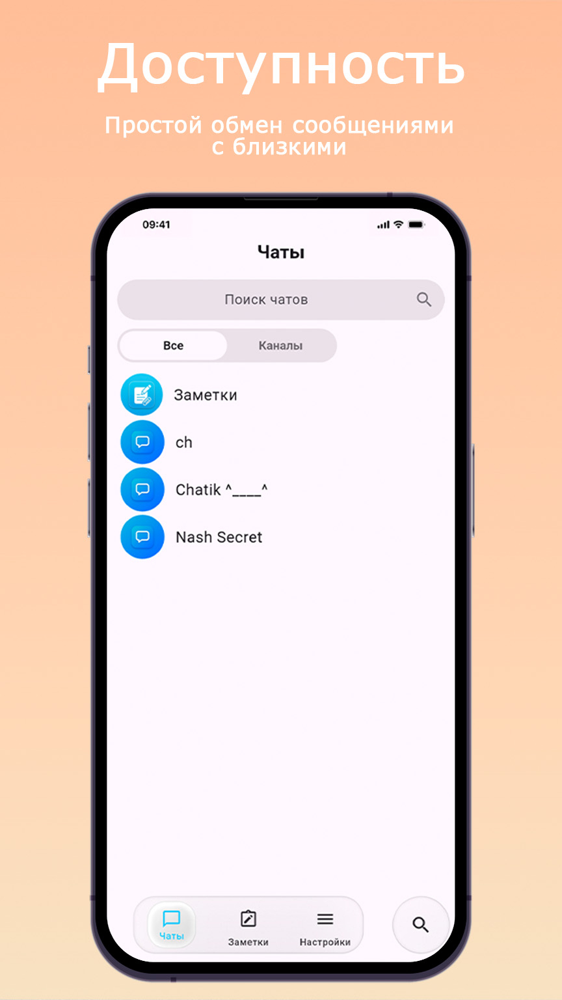
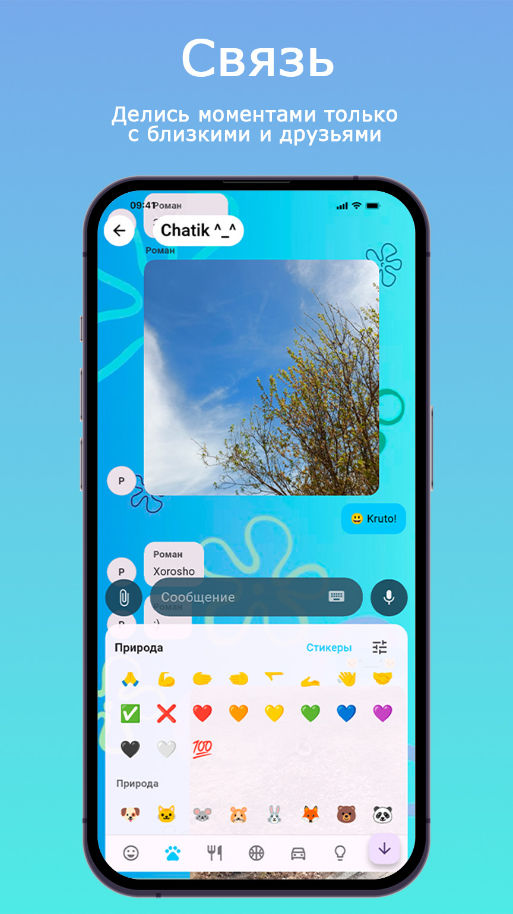
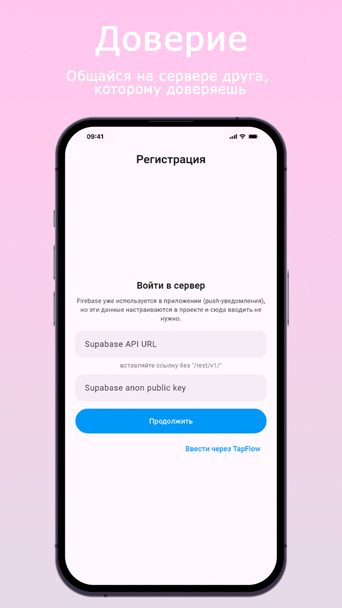
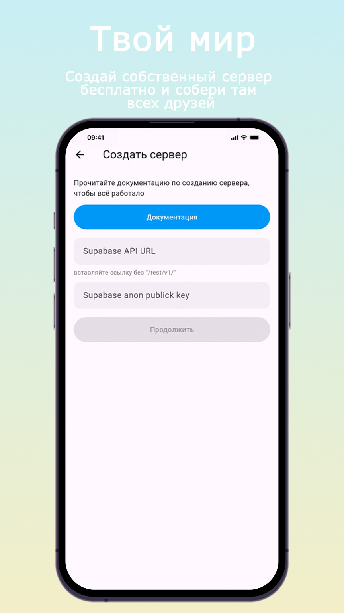
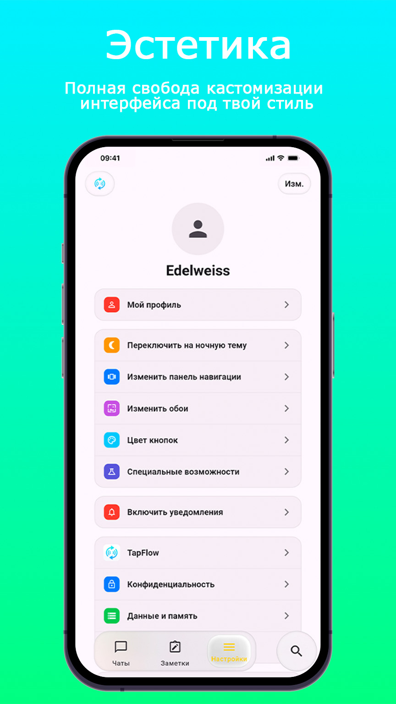
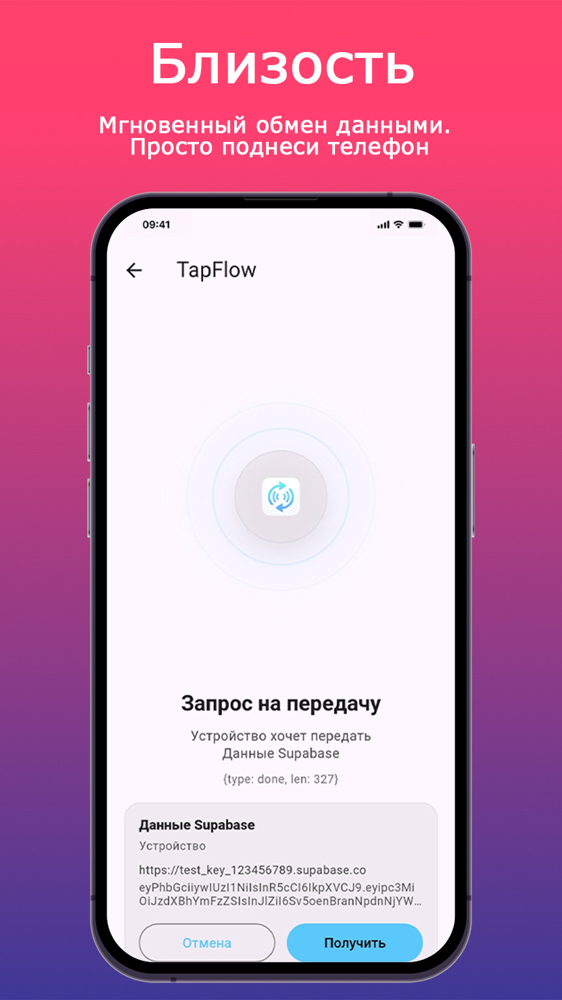

# MyCircle Messenger — Client UI & Frontend Modules (Flutter)

Репозиторий содержит демонстрационный исходный код и клиентские модули графического интерфейса мессенджера **MyCircle**, разрабатываемого на фреймворке Flutter.

> **Важная информация для модераторов и проверяющих органов:**
> Данный репозиторий представляет собой **исключительно открытый учебный компонент (клиентскую программную оболочку)** и не содержит в себе готовой скомпилированной серверной инфраструктуры, встроенных систем шифрования или независимых сетевых узлов. Проект предназначен для демонстрации навыков кроссплатформенной верстки и интеграции UI-компонентов.

## 🛠 Архитектурные особенности и стек
* **Frontend-фреймворк:** Flutter (Dart)
* **Концепция дизайна:** Минималистичный 2D-интерфейс с поддержкой элементов кастомизации Liquid Glass.
* **Назначение модулей:** Макеты групповых комнат, кастомные панели настроек, шаблоны цветовых схем интерфейса и демонстрационные экраны навигации.

## ⚖️ Правовая информация (Legal Documents)
В соответствии с требованиями к прозрачности программного обеспечения, официальная правовая документация проекта размещена по следующим прямым ссылкам:

* 📄 **[Политика конфиденциальности (Privacy Policy)](privacy.md)** — регламентирует отсутствие сбора персональных данных со стороны клиентской оболочки.
* 📄 **[Лицензионное соглашение (EULA)](eula.md)** — определяет правила использования графических интерфейсов и исходного кода в рамках законодательства РФ.

---
*Проект находится на стадии раннего прототипирования (активного тестирования интерфейсных модулей).*

# 🌐 MyCircle

**MyCircle** — это современный, минималистичный децентрализованный мессенджер с открытым исходным кодом, созданный на фреймворке Flutter. Проект ориентирован на абсолютную автономию пользователей, приватность и глубокую визуальную кастомизацию интерфейса.

В отличие от классических мессенджеров, MyCircle не привязан к единой корпоративной базе данных. Здесь каждый пользователь может развернуть собственное изолированное виртуальное пространство (сервер) или подключиться к комнатам своих друзей.

---

## ✨ Ключевые особенности

* **🛡️ Полная децентрализация:** Архитектура мессенджера исключает единую точку отказа или утечки данных. Общение строится вокруг независимых серверов на базе экосистемы Supabase.
* **🔒 Контроль над данными:** Все переписки, медиафайлы и логи хранятся исключительно на сервере создателя конкретного узла сети или локально на устройствах участников. Разработчик приложения не имеет доступа к вашему контенту.
* **🎨 Дизайн-система Liquid Glass:** Интерфейс выполнен в красиво, эстетичном стиле с объёмными элементами, плавными анимациями и поддержкой «стеклянного» эффекта, снижающего когнитивную нагрузку (настраивается в клик).
* **⚙️ Тотальная кастомизация:** Приложение позволяет детально пересобирать визуал под себя: менять стили панелей, градиенты кнопок, либо переключаться в минималистичный 2D-режим.
* **💬 Безлимитные групповые комнаты:** Пространства внутри серверов оптимизированы для координации задач, работы в командах или общения в ламповых сообществах по интересам.

---

## 🛠️ Архитектура и технологии

Проект построен на передовом стеке для обеспечения максимальной производительности на мобильных устройствах:

* **Frontend:** Dart / Flutter (с акцентом на кастомную отрисовку UI и реактивные интерфейсы).
* **Backend & Sync:** Supabase (PostgreSQL, Realtime каналы для мгновенного обмена сообщениями, WebSockets).
* **Безопасность:** Авторизация и подключение к приватным пространствам по защищённым токенам конфигурации со сквозным шифрованием.

---

## 🚀 Как начать использовать

### Для пользователей
1. Скачайте актуальный релизный билд в разделе **Releases**.
2. Введите конфигурационный токен сервера вашего друга или разверните свой собственный по инструкции ниже.

### Для разработчиков и хостеров (Быстрый старт)
Чтобы поднять свой личный сервер MyCircle:
1. Создайте бесплатный проект на платформе [Supabase](https://supabase.com/).
2. Склонируйте SQL-скрипт инициализации таблиц из файлов приложения этого репозитория.
3. Поделитесь с друзьями данными anon public api key и api url

---

## 📸 Скриншоты интерфейса

Ниже представлены скриншоты приложения с функционалом (на некоторых скриншотах):

  
  
  
  
  
  

